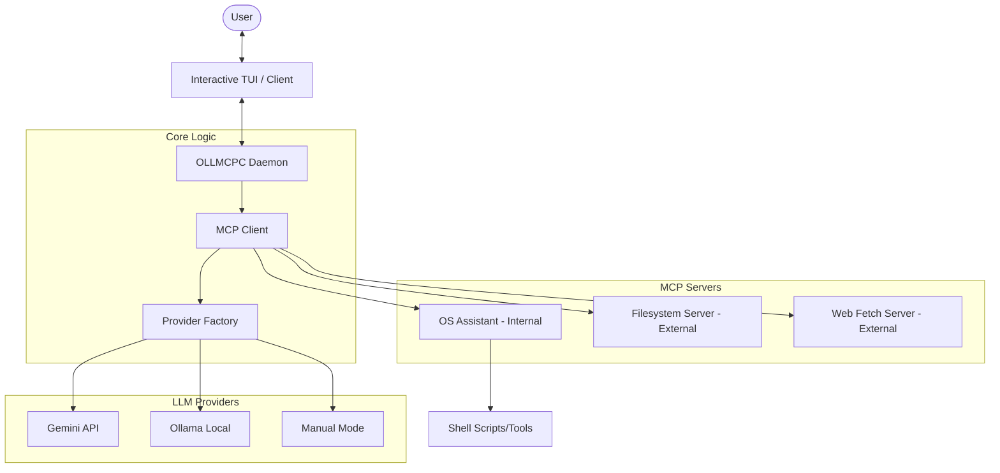

# OLLMCPC System Documentation

## 🏗 System Architecture

The OLLMCPC system is designed as a modular bridge between Large Language Models (LLMs) and local/remote system tools via the Model Context Protocol (MCP).

## 📂 Project Structure

- `src/main.cpp`: Entry point. Handles CLI arguments and command routing.
- `src/app/interactive.cpp`: The "Brain" of the UI. Manages the chat loop, HIL (Human-in-the-Loop) logic, and terminal styling.
- `src/app/config.cpp`: Configuration manager. Loads/Saves `~/.ollmcpc.json`.
- `src/mcp/client.cpp`: Orchestrates communication between the LLM and the servers.
- `src/mcp/server_proxy.cpp`: The bridge that spawns external processes (npx, python, binary) and communicates via stdio pipes.
- `src/llm/`: Strategy-pattern implementations for different AI backends.
- `src/utils/`: Lightweight logging, JSON parsing (no-dependency), and terminal styling.

## 🚀 Daemon vs Interactive Mode (Planned Architecture)

One of the premium features is the separation of the heavy lifting from the interface:

1.  **The Daemon (`serve`)**:
    - **Purpose**: Persistent background process.
    - **Duties**: Keeps MCP servers alive, maintains LLM connection, potentially caches context.
    - **IPC**: Communicates via a Unix Domain Socket (`/tmp/ollmcpc.sock`).

2.  **The Interactive Client (`interactive`)**:
    - **Purpose**: Lightweight TUI.
    - **Duties**: Visual rendering, user input capture, password masking for sudo.

## 🛠 Setup & Installation

### Option 1: Docker (Recommended)
Use the included `Dockerfile` to launch a fully-contained environment with Ollama and all dependencies pre-installed.

### Option 2: Starter Script
Run `scripts/setup.sh` to install system dependencies, build the project, and pull the required AI models.
