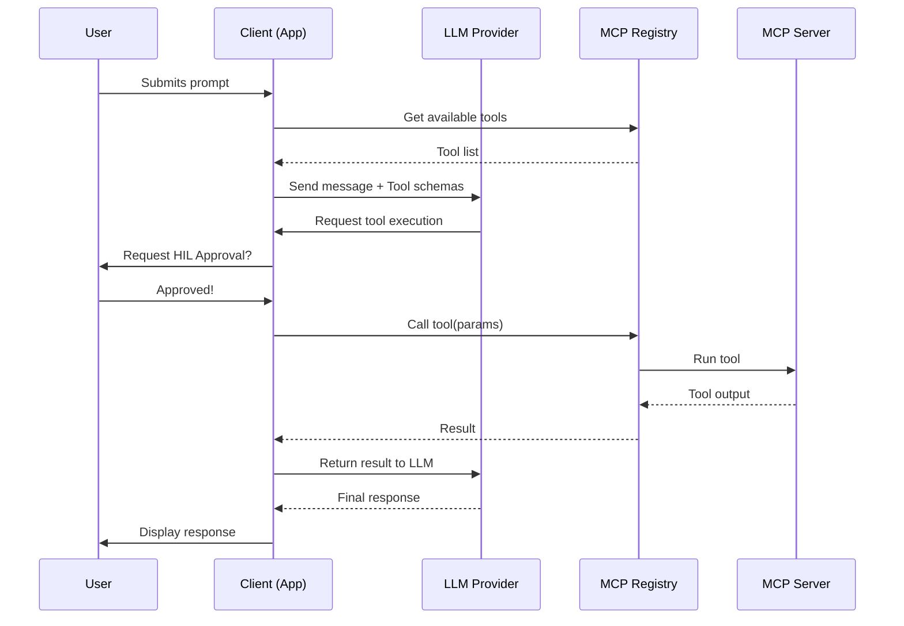

# System Architecture

OLLMCPC is built with a modular approach, separating the UI, LLM logic, and protocol handling.

## Overview

The system consists of three main layers:

1.  **Application Layer**: Handles the CLI, Terminal UI (TUI), and configuration management.
2.  **LLM Layer**: A set of provider strategies that translate general tool/chat requests into provider-specific API calls (Ollama, Gemini).
3.  **MCP Layer**: Implements the Model Context Protocol. It manages server lifecycles, tool discovery, and execution.

## Flow Diagram

## Key Components

### The Client (App)
The main entry point (`main.cpp`) handles routing. The interactive loop (`interactive.cpp`) manages the state of the chat, rendering colors, and processing slash commands.

### The MCP Registry
The `MCPClient` class is the central nervous system. It:
*   Launches local and external servers.
*   Aggregates tools from all connected servers into a single registry.
*   Dispatches tool calls to the correct server based on the server prefix.

### Server Proxies
External servers (like those run via `npx`) are managed by `MCPServerProxy`. It handles:
*   Process spawning via `pipe`.
*   JSON-RPC communication over `stdin`/`stdout`.
*   Error handling and logging.
