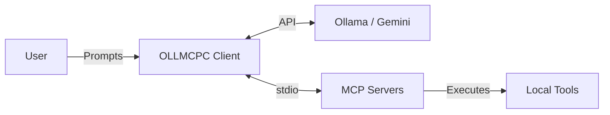

# Welcome to OLLMCPC

OLLMCPC is a high-performance, terminal-based client for the **Model Context Protocol (MCP)**. It acts as a bridge between powerful Large Language Models (LLMs) and your local system environment.

!!! tip "High Performance"
    Written in modern C++17, OLLMCPC is designed for speed and minimal resource usage, making it ideal for developers who want a snappy local AI assistant.

## Key Features

*   **Multi-Provider Integration**: Support for Ollama (local) and Gemini (cloud).
*   **Built-in OS Assistant**: A dedicated MCP server that provides tools for filesystem access, process management, and more.
*   **Human-in-the-Loop (HIL)**: Built-in safety mechanism that prompts for user approval before executing system tools.
*   **Extensible**: Easily connect external MCP servers written in any language (Node.js, Python, Go).
*   **Modern TUI**: A beautiful terminal interface with colorized output and interactive menus.

## How it Works

OLLMCPC connects to an LLM provider and one or more MCP servers. When you ask a question, the LLM determines if it needs to use a tool provided by an MCP server. If so, OLLMCPC handles the communication, enforces safety checks, and returns the results to the LLM.

## Getting Started

Ready to dive in? Check out the [Installation](installation.md) guide to get OLLMCPC running on your system.
